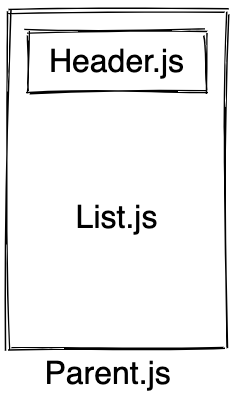

If you are familiar with animations on React-Native, you probably have dealt with the Animated API provided by default. After several months of development, an alternative animated library has been released recently to its version 1: [react-native-reanimated](https://github.com/kmagiera/react-native-reanimated).
To sum up, this library provides a nicer API along with substantial performance improvements because all the animations run on the native side. I advise you to check [this link](https://github.com/kmagiera/react-native-reanimated#omg-why-would-you-build-this-motivation) for a complete overview of the advantages.

---

## The Challenge

As an introduction to the reanimated API, we are going to implement a __collapsible scrollview header__. When the user scrolls down the header of the page disappears and then appears again when the user scrolls up. Still, a draw is more explanative than a text, here is an example on Airbnb's app:

<div style="display:flex; justify-content:center;">

</div>

## Install
First, let's install react-native-reanimated:

```bash
npm install react-native-reanimated
react-native link react-native-reanimated
```

A utility that I like to add along with reanimated is react-native-redash which provides some useful functions. You can see it as a lodash for react-native-reanimated.

```bash
npm install react-native-redash
```


## Architecture

We are going to architecture our solution in 3 parts:
1. A parent View
2. A header placed at position absolute. The challenge is to animate his translation according to the scroll
3. A ScrollView which is going to drive the animation




## Code

Following the architecture scheme, our code should have to start a parent which contains a header and a list:

```jsx
/* Parent.js */

import * as React from "react";
import { View } from "react-native";
import { Header } from "./Header";
import { List } from "./List";

export const Parent = () => {
return (
<View>
<Header />
<List />
</View>
);
};
```

As for the header, it is going to have an absolute position, because we want the ScrollView to take the entire screen and not bothered by the header:

```jsx
/* Header.js */

import * as React from "react"
import { View } from "react-native"

const HEADER_HEIGHT = 60

export const Header = () => {
  return (
    <View
      style={{
        height: HEADER_HEIGHT,
        position: "absolute",
        top: 0,
        width: "100%",
        zIndex: 2,
        backgroundColor: "#ffb74d",
        justifyContent: "center",
        alignItems: "center",
      }}
    >
      <Text>Header</Text>
    </View>
  )
}
```

Finally, we have the list component fetching some Lorem Pictum images placed inside a ScrollView.

```jsx
/* List.js */

import * as React from "react"
import { ScrollView, Image } from "react-native"

export const List = () => {
  return (
    <ScrollView
      scrollEventThrottle={16}
      contentContainerStyle={{ paddingTop: 50 }}
    >
      {Array.from({ length: 10 }, (v, k) => (
        <Image
          style={{ width: "100%", height: 200, marginTop: 50 }}
          key={k + ""}
          source={{ uri: "https://picsum.photos/200/300" }}
        />
      ))}
    </ScrollView>
  )
}
```

Now this is how your app should look like:
<div style="display:flex; justify-content:center;">

</div>


But we are lacking the scroll driving the animation, so let's add it using react-native-reanimated. First, we define an animated value in the parent file that is going to be shared with the children. We are going to call this value `y` since it is going to represent the translation in the vertical axis of the header.

```jsx
/* Parent.js */

import * as React from "react"
import { View } from "react-native"
import { Header } from "./Header"
import { List } from "./List"
import Animated from "react-native-reanimated"

export const Parent = () => {
  // Create an "y" animated value and pass it down to the children
  const y = new Animated.Value(0)

  return (
    <View>
      <Header y={y} />
      <List y={y} />
    </View>
  )
}
```

Now, let's drive this "y" value by the ScrollView. This last one got a prop called `onScroll` that is used to bind the scroll to a value. We are also going  to use `react-native-redash` here to get the benefit of a concise syntax for this binding:

```jsx
/* List.js */

import * as React from "react"
import { Image } from "react-native"
import { onScroll } from "react-native-redash"
import Animated from "react-native-reanimated"

export const List = props => {
  return (
    // Use onScroll to update the y value
    <Animated.ScrollView
      onScroll={onScroll({ y: props.y })}
      scrollEventThrottle={16}
      contentContainerStyle={{ paddingTop: 50 }}
    >
      {Array.from({ length: 10 }, (v, k) => (
        <Image
          style={{ width: "100%", height: 200, marginTop: 50 }}
          key={k + ""}
          source={{ uri: "https://picsum.photos/200/300" }}
        />
      ))}
    </Animated.ScrollView>
  )
}
```

Finally, let's translate the header according to the `y` animated value. We need to convert the previous `View` to an `Animated.View` in order to animate that part of the UI. Then, we just need to pass the y value to the translateY key in the transform property. This is going to translate the `Animated.View` according to the y value updated in real-time by the `ScrollView`

```jsx
/* Header.js */

import * as React from "react"
import { Text } from "react-native"
import Animated from "react-native-reanimated"

const HEADER_HEIGHT = 60

export const Header = props => {
  return (
    // Use Animated.View instead of View
    <Animated.View
      style={{
        height: HEADER_HEIGHT,
        position: "absolute",
        top: 0,
        width: "100%",
        zIndex: 2,
        backgroundColor: "#ffb74d",
        justifyContent: "center",
        alignItems: "center",
        /* Translate the View according to y */
        transform: [{ translateY: props.y }],
      }}
    >
      <Text>Header</Text>
    </Animated.View>
  )
}
```


<div style="display:flex; justify-content:center;">

</div>

Good, so one last thing to be done is to fix the direction of the translation and tell the header to not leave the boundaries of his height. You may be familiar with the `Animated.interpolate` from `react-native` and the one in `react-native-reanimated` works pretty much the same. In our case we are going to do:

```jsx
const translateY = interpolate(props.y, {
  inputRange: [0, HEADER_HEIGHT],
  outputRange: [0, -HEADER_HEIGHT]
});
```

Which can be translated by: "*Whenever y equals X, translateY should equal minus X*". Here we are fixing the orientation of the header's translation. 
The last part is to tell the header to not leave the boundaries of his position and to always stay on defined edges when you scroll. The collapsible scrollview header is the typical example of this behavior, and we are going to use the diffClamp method. 

```
const diffClampY = diffClamp(props.y, 0, HEADER_HEIGHT);
```

Which can be translated by: "*Create a new Animated value that is limited between 2 values (0 and HEADER_HEIGHT). It uses the difference between the last value so even if the value is far from the bounds it will start changing when the value starts getting closer again.*"
So, let's put the glue about all the concepts we just told, and this is what is going to be the header file: 

```jsx
/* Header.js */

import * as React from "react"
import { Text } from "react-native"
import Animated from "react-native-reanimated"

const HEADER_HEIGHT = 60
const { diffClamp, interpolate } = Animated

export const Header = props => {
  const diffClampY = diffClamp(props.y, 0, HEADER_HEIGHT)
  const translateY = interpolate(diffClampY, {
    inputRange: [0, HEADER_HEIGHT],
    outputRange: [0, -HEADER_HEIGHT],
  })
  return (
    <Animated.View
      style={{
        height: HEADER_HEIGHT,
        position: "absolute",
        top: 0,
        width: "100%",
        zIndex: 2,
        backgroundColor: "#ffb74d",
        justifyContent: "center",
        alignItems: "center",
        transform: [{ translateY: translateY }],
      }}
    >
      <Text>Header</Text>
    </Animated.View>
  )
}
```


And so finally, here it comes, this is how we get as a final animation  🎉 🎉 🎉.

<div style="display:flex; justify-content:center;">

</div>

## Conclusion

Congratulations! You have made your first animation with the reanimated API by making the **collapsible header scrollview** animation. I hope you will enjoy the powerfulness of this library.
Go to the [Github Repository](https://github.com/PierreCapo/personal-blog/tree/master/code-examples/introduction-to-react-native-reanimated) to have a quick overview of the code developed in this article.
