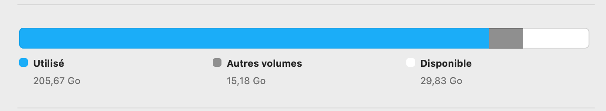
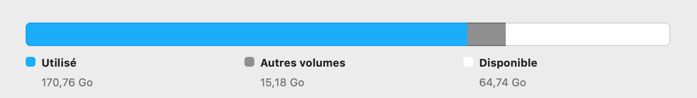
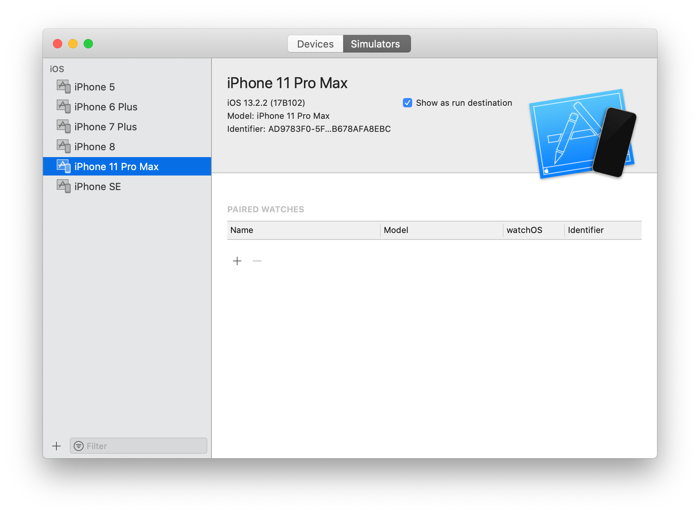
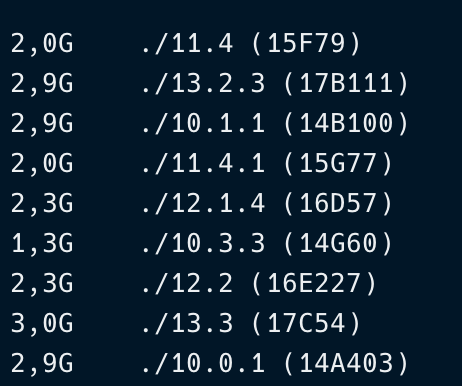

# React-Native developers: Cleaning disk space on your Mac

I have been developing React-Native apps for more than one year now. Since Apple machines are quite expensive, I've only picked 256 GB Mac Book Pro for developing and sadly, it has been filled faster than I expected. **A lot of space were taken by XCode** but it can be tricky for a React Native developer to know what you can delete safely. In this blog post, I'm going to share what I did to **remove more than 30 GB** of "useless" files from iOS builds.

Before cleaninng:



After cleaning:



Before starting, be sure that all the apps you have developed have their code under a version control system. We are going to delete a lot of cached data, and you probably want to not lose all your work 😜

## A useful bash command

Before digging into the actions I've taken, **there is one command you MUST know** when you want to find what files and folders are taking spaces on your machine:

```Bash
$ find . -maxdepth 1 -mindepth 1 -type d -exec du -hs {} + | sort -r -h
```

This bash command will list the files with their sizes associated sorted from the biggest one to the smallest one in the current directory. Really useful to know by yourself what files/folders taking the more spaces on your computer.

## Cleaning Archives and Derived Data

One thing we will do first is cleaning our code that is cached when we build our iOS apps. **I invite you to download that awesome CLI tool** that is also useful for your day-to-day react-native work when you have issue with your cache: [rn-game-over](https://github.com/taboulot/rn-game-over)

From your terminal, install it, and then run the command to clean your iOS cache:

```Bash
npm install -g rn-game-over
rn-game-over -o
```

It will basically clean your derived data and Archives that have been stored during the iOS builds.

## Deleting unused simulators

It is interesting to notice that every time you create and launch a new simulator in XCode, more than 500 Mb are allocated to it. And after quite some time of development, the list of simulators you have available in XCode can be really large which means a lot of disk space is reserved for your simulators.

My advice: **Delete all simulators and recreate the ones that you use the most**.

You can easily add them again if you need it. For instance, I personally use a lot the iPhone 11 Pro Max and the iPhone SE during my developments. So I've recreated both of them only.

1. Open XCode
2. `Window` -> `Devices and simulators`


3. One by one select them and press the `Delete` key in your keyboard to delete them.



4. Then clear all the data of the builds you made in it:

```Bash
$ cd ~/Library/Developer/CoreSimulator/Devices
$ rm -rf *
```

5. Now you can create new ones that you really use that will be virgin of any apps (so no extra space taken).

## Deleting outdated versions of iOS

Now that you have cleaned up your simulator, we can also remove from XCode iOS versions that you don't use anymore (it can be still downloaded again if you need them in a potential future).

```Bash
$ cd ~/Library/Developer/Xcode/iOS DeviceSupport
```

There, you can delete iOS versions that you consider you won't be using much. Versions that are not the ones that your simulators use or versions not really used according to this [website about iOS versions market share](https://gs.statcounter.com/ios-version-market-share/mobile-tablet/worldwide). For deleting, just do:

```Bash
$ rm -rf <ios_version_folder>
```

Personally this is for instance what I had (and I kept only iOS 10.3.3 and iOS 13.2.3 in order to save as much disk space as possible):



## Conclusion

As shown above, it has allowed me to gain 30 GB of disk space in my MacBook. I felt really happy as a react-native developer to clean safely stuff from XCode and iOS builds.
