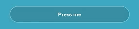
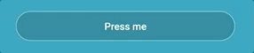

# You don't know buttons


### Use TouchableNativeFeedback

When I stared to use buttons a long time ago, I used 100% of times the `TouchableOpacity` component aside with `TouchableHighlight` sometimes. 

<div style="display:flex; justify-content:center;">

</div>
TouchableOpacity

<div style="display:flex; justify-content:center;">

</div>
TouchableHighlight

What I didn't know is that React Native actually provides us a better component to handle Touchable on Android: `TouchableNativeFeedback`. This component renders the nice **Ripple** effect that you use to see on Android:

<div style="display:flex; justify-content:center;">

</div>

TouchableNativeFeedBack not only looks nicer, it also makes your app feeling more native, so I really advice you to pick it over its alternative on Android.

_Note 1:_ On iOS, there is no counterpart for the `TouchableNativeFeedback`, so I advice you to fallback on whether the classic `TouchableOpacity` or `TouchableHighlight`.

_Note 2:_ Button with Ripple effect are available on Android natively since **Android 5** and will make your app crashes if you use it in previous versions. Same as on iOS, you should fallbback to a `TouchableOpacity` button for instance for Android <= 4 by using the `Platform` API.

_Note 3:_ One think that you **need** to think about when you implement this button is the color of the Ripple effect. On button with a dark background color you'll want a Ripple with a light color effect. And on a light background color you'll want a dark color for your Ripple Effect.

```JSX
import { TouchableNativeFeedBack, View, Text } from "react-native";

export const AppButtonAndroid = () => {
	return (
        // Ripple effect is white and background color is black ✅
	<TouchableNativeFeedback background={TouchableNativeFeedback.Ripple("white")}>
	  <View style={{backgroundColor: "black", height:100}} />
	</TouchableNativeFeedback>);
}
```

However, you have to know that this component got some weird bug on Android P if your button got rounded corners. 

<div style="display:flex; justify-content:center;">

</div>

As of November 2019, you need to add a `View` with the same `border-radius` of your button and an `overflow: "hidden"` that wraps your button to forbid the Ripple effect to go outside of the boundaries of your button. [(See this issue)](https://github.com/facebook/react-native/issues/6480#issuecomment-234846355)


```JSX
import { TouchableNativeFeedBack, View } from "react-native";

export const AppButtonAndroid = (props) => {
  const containerHeight = 32;
   return ( 
   // Add a wrapping View to prevent the Ripple effect bug
    <View
      style={{
        borderRadius: containerHeight / 2,
        height: containerHeight,
        backgroundColor: "black",
        overflow: "hidden",
        alignSelf: "center" 
      }}
    >
      <TouchableNativeFeedback
        background={
             TouchableNativeFeedback.Ripple("white")
        }
        {...props}
      >
      {props.children}
      </TouchableNativeFeedback>
    </View>);
}
```

## Don't send events twice

Usually, you don't want that if your user press really fast your button, the action can get sent twice. It can be particulary annoying when those are buttons responsible of navigation and your see your screen getting pushed two times because of your user has double tapped your button. To avoid that, you can use some common functions called `Debounce` or `Throttle`. Although their implementations slightly differ, the concept to grab behind it, is that one event only will be fired if the user press the button in a certain period of time (500 ms for instance).


Some libraries like `lodash` gives you those functions out of the box, you should really [check them](https://lodash.com/docs/4.17.15#debounce) for more details.

### Take care of icons

It's really common to include icons in your buttons next to your text to make it more understandable for your user. And it's also a good accesibiliy practice!

However, the font-padding for the default font on iOS (San Francisco) and Android (Roboto) are different, so your icon will actually look mis-aligned between those devices.

To fix that, you'll need to adjust for **each platform** the position of your icons by playing with margins value.

```JSX
import { Platform, TouchableNativeFeedBack, TouchableOpacity } from "react-native;

export const AppButton = (props) => {
  const Touchable = Platform.OS === "android" ? TouchableNativeFeedBack : TouchableOpacity;
  const { text, iconName } = props;
	return (
        // Add a margin depending on the platform
	<Touchable >
	  <View style={{flexDirection: "row"}}>
          <Icon name={iconName} style={{marginTop: Platform.OS === "android" ? -4 : -2}} />
          <Text>{text}</Text>
          </View>
	</Touchable>);
}
```

### Conclusion: Wrapping everything together


